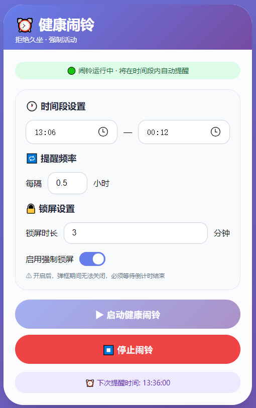

# ⏰ 健康闹铃 - 拒绝久坐

一款强制提醒活动的桌面应用，帮助久坐用户定时起身活动，支持锁屏强制提醒。

[健康闹铃 - 拒绝久坐](https://clock.pengline.cn/)

## ✨ 功能特性

- 🕐 **自定义时间段** - 设置工作时段（如 9:00 - 18:00），只在需要的时间段内提醒
- 🔁 **灵活提醒频率** - 0.5 ~ 6 小时可调，满足不同工作节奏
- 🔒 **强制锁屏模式** - 开启后弹框期间无法关闭，必须等待倒计时结束
- ⏱️ **可配置锁屏时长** - 1 ~ 30 分钟自由调节
- 🎨 **精美视觉设计** - 渐变背景、毛玻璃效果、动画圆环进度条
- 💾 **配置持久化** - 自动保存设置，刷新不丢失
- 🚶 **活动建议** - 提醒时提供简单的活动建议（走动、喝水、看远方）

## 📸 界面预览

### 主界面




### 锁屏提醒界面


## 🚀 快速开始

### 方式一：直接使用 HTML 文件

1. 下载 `health-alarm.html` 文件
2. 双击用浏览器打开即可使用
3. 建议使用 Chrome/Edge/Safari 等现代浏览器

### 方式二：打包为桌面应用

#### 使用 PakePlus 打包

1. **准备在线地址**（二选一）：
   - 使用 GitHub Pages 托管 HTML 文件
   - 使用 Vercel/Netlify 等静态托管服务

2. **下载并安装 PakePlus**

3. **配置 GitHub Token**：
   - 在 GitHub Settings → Developer settings → Personal access tokens 创建 Token
   - 权限勾选：`repo`、`workflow`、`user`
   - 将 Token 粘贴到 PakePlus 设置中

4. **打包配置**：
   ```json
   {
       "name": "health-alarm",
       "showName": "健康闹铃",
       "webUrl": "https://你的网页地址.com",
       "desktop": {
           "fullscreen": true,
           "width": 1200,
           "height": 800,
           "resizable": true
       }
   }
   ```

5. **构建并下载** `.exe` 文件

#### 直接添加到主屏幕（手机端）

用 Safari 打开网页 → 分享按钮 → 添加到主屏幕


## 📋 使用说明

### 基本设置

| 设置项   | 说明                   | 范围          |
| :------- | :--------------------- | :------------ |
| 开始时间 | 每日提醒开始时间       | 00:00 - 23:59 |
| 结束时间 | 每日提醒结束时间       | 00:00 - 23:59 |
| 提醒频率 | 两次提醒之间的间隔     | 0.5 ~ 6 小时  |
| 锁屏时长 | 每次提醒的锁屏时间     | 1 ~ 30 分钟   |
| 强制锁屏 | 开启后无法提前关闭弹框 | 开/关         |

### 运行状态

- **闹铃未启动**：灰色状态，可自由修改配置
- **闹铃运行中**：绿色状态，显示下次提醒时间
- **锁屏提醒中**：全屏弹框，强制/非强制模式


## ❓ 常见问题

### Q: 为什么倒计时结束了没有自动关闭弹框？

A: 检查浏览器是否允许 JavaScript 运行，刷新页面重试。

### Q: 强制锁屏模式下如何退出？

A: 必须等待倒计时结束，无法提前关闭。这是设计初衷，目的是强制活动。

### Q: 关闭浏览器后闹铃还会运行吗？

A: 不会。闹铃依赖于浏览器运行，关闭页面后闹铃会停止。建议保持页面打开或打包为桌面应用。

### Q: 可以设置跨天的时间段吗？

A: 支持。例如 22:00 - 06:00，系统会自动处理跨天逻辑。

### Q: 打包成 EXE 后如何设置开机自启？

A: 将生成的 EXE 快捷方式放入系统启动文件夹：

- 按 `Win + R`
- 输入 `shell:startup`
- 粘贴快捷方式
