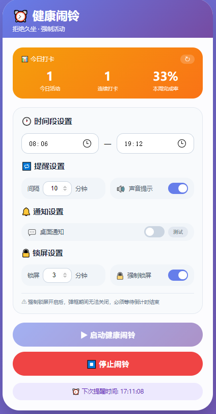
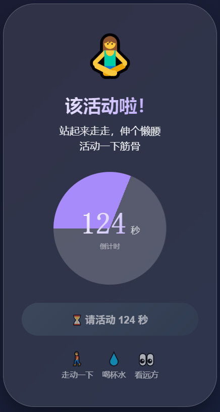

# ⏰ 健康闹铃 - 拒绝久坐

一款强制提醒活动的桌面应用，帮助久坐用户定时起身活动，支持锁屏强制提醒、桌面通知、每日打卡统计。

## ✨ 功能特性

### 核心功能
- 🕐 **自定义时间段** - 设置工作时段（如 8:00 - 18:00），只在需要的时间段内提醒，支持跨天设置
- 🔁 **灵活提醒频率** - 10 ~ 300 分钟可调，步长 10 分钟，满足不同工作节奏
- 🔒 **强制锁屏模式** - 开启后弹框期间无法关闭，必须等待倒计时结束，真正强制活动
- ⏱️ **可配置锁屏时长** - 1 ~ 30 分钟自由调节
- 🔊 **声音提示** - 提醒时播放蜂鸣音效，弹框期间每隔 3 秒循环提醒
- 💬 **桌面通知** - 支持系统级通知，即使浏览器在后台也能收到提醒

### 统计与反馈
- 📊 **每日打卡统计** - 记录今日活动次数、连续打卡天数
- 📈 **本周完成率** - 基于目标次数自动计算完成百分比
- ⏰ **下次提醒显示** - 实时显示下一次提醒的具体时间

### 用户体验
- 🎨 **精美视觉设计** - 渐变背景、毛玻璃效果、动画圆环进度条
- 💾 **配置持久化** - 自动保存设置，刷新不丢失
- 🚶 **活动建议** - 提醒时提供简单的活动建议（走动、喝水、看远方）
- 🎯 **实时输入校验** - 输入超出范围自动修正，带错误提示
- 📱 **响应式布局** - 完美适配手机、平板、电脑

## 📸 界面预览

### 主界面

### 锁屏提醒界面

## 🚀 快速开始

### 方式一：在线使用

访问 [健康闹铃 - 拒绝久坐](https://clock.pengline.cn/)，直接用浏览器打开即可使用。

> 💡 建议使用 Chrome/Edge/Safari 等现代浏览器，可获得最佳体验。

### 方式二：安装桌面应用

下载安装 exe 软件：[GitHub Releases](https://github.com/neopen/health-clock-app/releases) 找最新版下载

支持平台：Windows、macOS、Linux

### 方式三：PWA 安装（推荐）

1. 用 Chrome/Edge 打开网页
2. 点击地址栏右侧的「安装」图标
3. 选择「安装」，即可像原生应用一样使用

## 📋 使用说明

### 基本设置

| 设置项 | 说明 | 范围 | 默认值 |
| :----- | :--- | :--- | :----- |
| 开始时间 | 每日提醒开始时间 | 00:00 - 23:59 | 08:00 |
| 结束时间 | 每日提醒结束时间 | 00:00 - 23:59 | 18:00 |
| 提醒频率 | 两次提醒之间的间隔 | 10 ~ 300 分钟（步长10） | 40 分钟 |
| 声音提示 | 时间到支持声音提醒 | 开/关 | 开 |
| 桌面通知 | 系统级通知提醒 | 开/关 | 开 |
| 锁屏时长 | 每次提醒的锁屏时间 | 1 ~ 30 分钟 | 5 分钟 |
| 强制锁屏 | 开启后无法提前关闭弹框 | 开/关 | 关 |

### 统计卡片说明

| 指标 | 说明 |
| :--- | :--- |
| 今日活动 | 今日完成的活动提醒次数 |
| 连续打卡 | 连续完成活动的天数 |
| 本周完成率 | 本周活动次数 / 本周目标次数 × 100%（目标：每天3次） |

### 运行状态

| 状态 | 显示 | 说明 |
| :--- | :--- | :--- |
| 未启动 | ⚪ 闹铃未启动 | 灰色状态，可自由修改配置 |
| 运行中 | 🟢 闹铃运行中 | 绿色状态，显示下次提醒时间 |
| 锁屏中 | 全屏弹框 | 强制/非强制模式，倒计时显示 |

## ❓ 常见问题

### Q: 为什么倒计时结束了没有自动关闭弹框？

A: 检查浏览器是否允许 JavaScript 运行，刷新页面重试。如果问题持续，请清除浏览器缓存。

### Q: 强制锁屏模式下如何退出？

A: 必须等待倒计时结束，无法提前关闭。这是设计初衷，目的是强制活动。如果确实需要紧急退出，可以刷新页面或关闭浏览器标签页。

### Q: 关闭浏览器后闹铃还会运行吗？

A: 不会。闹铃依赖于浏览器运行，关闭页面后闹铃会停止。建议：
- 保持页面打开
- 安装为 PWA 应用
- 打包为桌面应用（Electron）

### Q: 可以设置跨天的时间段吗？

A: 支持。例如 22:00 - 06:00，系统会自动处理跨天逻辑，提醒会正确安排在夜间时段。

### Q: 桌面通知没有弹出怎么办？

A: 
1. 检查「桌面通知」开关是否开启
2. 点击「测试」按钮验证
3. 检查浏览器是否允许该网站的通知权限
4. 系统设置中确认通知功能已开启

### Q: 声音提示不工作？

A:
1. 检查「声音提示」开关是否开启
2. 首次点击「启动」时需要用户交互才能启用音频
3. 检查系统音量是否开启

### Q: 提醒频率步长为什么是 10 分钟？

A: 为了健康考虑，建议活动间隔至少 10 分钟以上。同时步长 10 分钟让设置更简洁。

## 📝 更新日志

### v0.3.0 (2026-04-13)
- 🎉 首次正式发布
- ✨ 支持自定义时间段和提醒频率
- 🔒 支持强制锁屏模式
- 🔊 支持声音提示
- 💬 支持桌面通知
- 📊 支持每日打卡统计
- 🎨 精美的毛玻璃 UI 设计
- 💾 配置自动保存

## 📄 许可证

MIT License

## 🙏 致谢

感谢所有使用和反馈的用户，让这个工具变得更好！

---

**如果觉得有用，请给个 ⭐ Star 支持一下！**